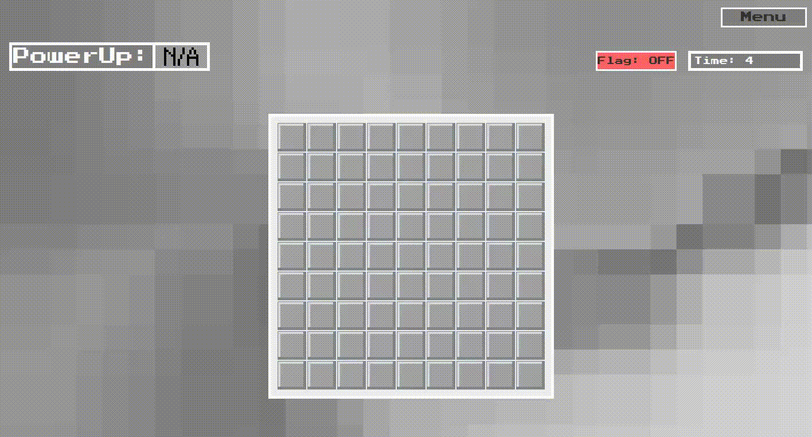
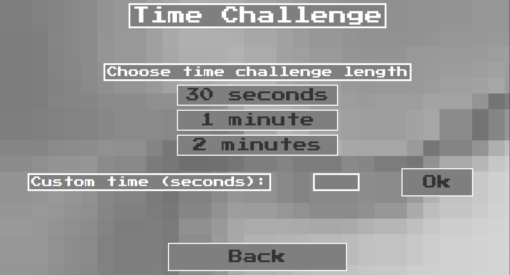
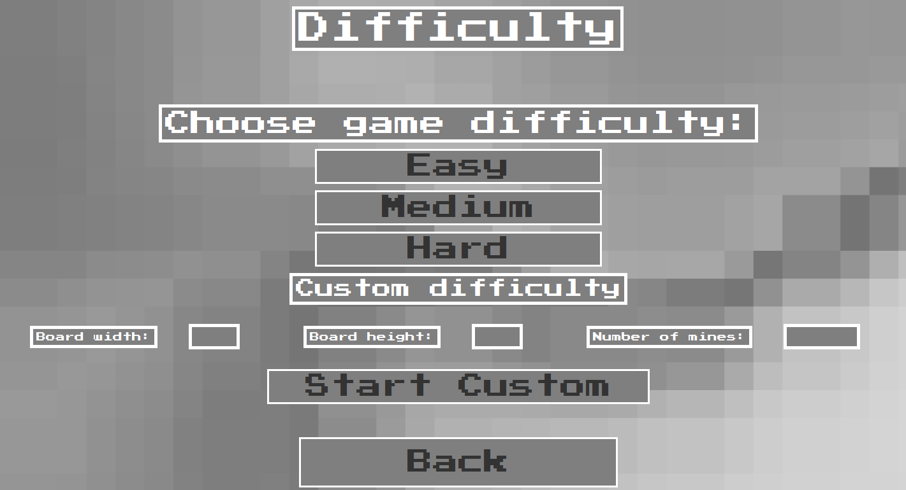
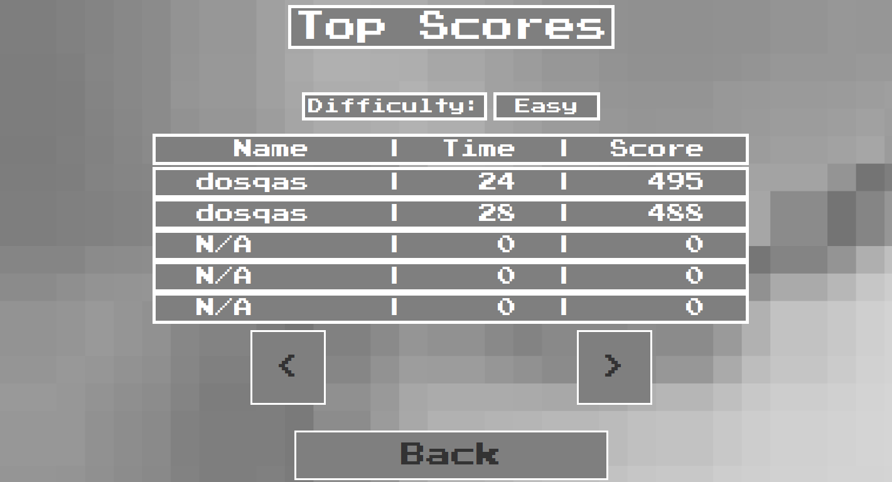
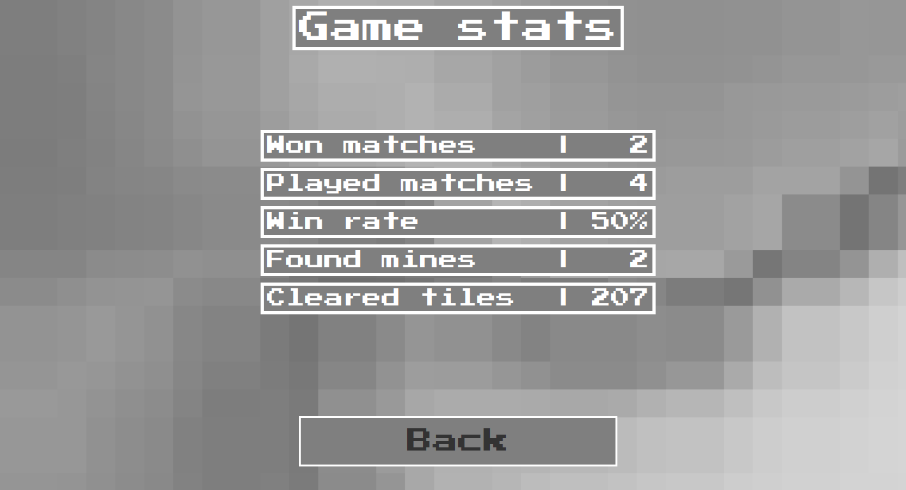
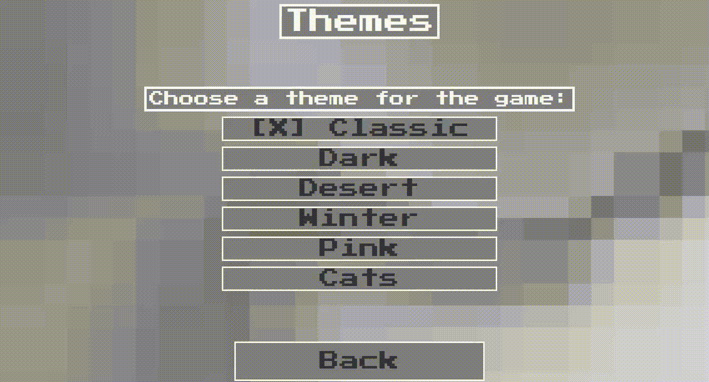
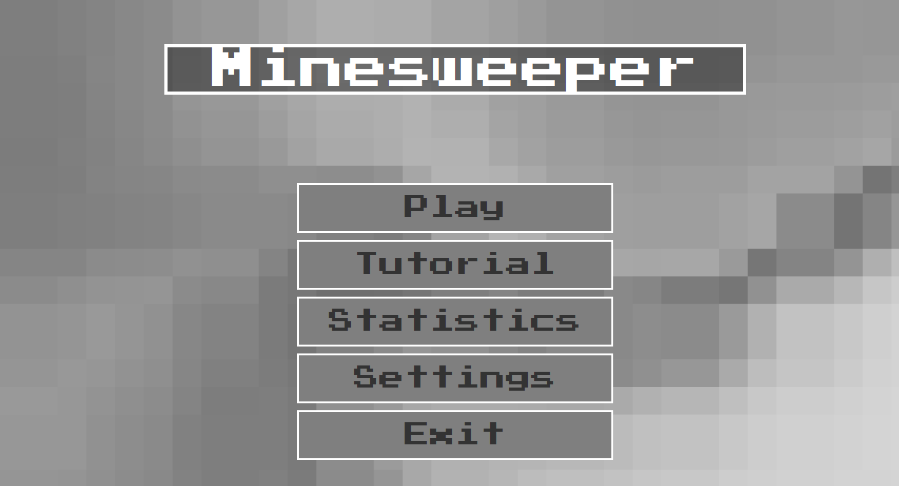

# 🎯 Minesweeper Game

## 🎉 Introduction

Welcome to my Minesweeper game! Inspired by childhood memories of playing without fully knowing the rules, this project brings a fresh take on the classic puzzle game. Now that I’ve grown and understood the mechanics better, I designed this version to be both nostalgic and exciting, packed with classic gameplay, custom difficulties, timed challenges, unique power-ups, multiple themes, and handy quality-of-life features.  

This project was developed in **Java with Swing** during my **Erasmus semester** in my **second year of university** as part of the **Programming in Java Language** course.

  
*Experience the classic Minesweeper gameplay with modern enhancements!*

---

## ⚙️ Requirements

* Java 22 or higher
* Maven

---

## 🚀 Installation

1. Clone this repository:

   ```bash
   git clone https://github.com/dosqas/minesweeper.git
   ```
2. Enter the project folder:

   ```bash
   cd minesweeper
   ```

---

## ▶️ Running the Application

1. Build with Maven:

   ```bash
   mvn clean install
   ```
2. Run the game:

   ```bash
   java -jar target/minesweeper.jar
   ```

---

## 🧪 Testing

Run automated tests using:

```bash
mvn test
```

---

## 🌟 Features & Gameplay Highlights

Growing up, I played Minesweeper without really understanding all the rules. Now, with a deeper knowledge and appreciation, I made this game to capture the fun and challenge of Minesweeper, with some modern twists:

* ❤️‍🩹 **Power-Ups:**

    * ❤️❤️❤️ 2 Extra Lives - keep playing even after a mine hit
    * 🛡️ Shield - blocks one mine hit and reveals surrounding tiles
    * 🔍 Reveal - uncovers a random mine on the board
    * 👣 3 Safe Steps - guarantees your next three moves are mine-free


* 🎵 **Immersive 8-bit Sounds & Dynamic Music:** The soundtrack changes as you uncover more tiles, enhancing the atmosphere.


* ⏰ **Timed Challenges:** Race against the clock to clear the board before time runs out.  
    
  *Challenge yourself with time-based gameplay.*

  
* ⚙️ **Custom Difficulties:** Pick your board size and mine count for a tailored experience.  
    
  *Customize the game to match your skill level.*

  
* 🏆 **Top Scores and Personal Stats:** Track your best times and scores to compete against yourself or others and check.  
    
  *Keep track of your achievements and progress.*  

    
  *Analyze your gameplay statistics.*


* 🎨 **Six Unique Themes:** Classic, Dark, Desert, Winter, Pink, and Cats — something for everyone!  
    
  *Switch between themes to personalize your experience.*


* 📱 **Optimized UI:** Designed for smooth performance and consistent gameplay experience across various systems.  
    
  *Navigate easily with a clean and intuitive interface.*

---

## 🛠️ Challenges & What I Learned

Developing this Minesweeper game was both fun and a great learning experience. The biggest challenges I faced were:

* 🐛 **Bug Squashing:** Debugging intricate game logic to ensure fair and accurate gameplay.
* 🎵 **Audio System Implementation:** Integrating a responsive audio engine that plays music and sound effects in sync with game events.
* ⚡ **Concurrency & Multithreading:** Managing threads for smooth UI updates and audio playback without freezing or stuttering.

Through solving these challenges, I deepened my understanding of **Java multithreading**, **event-driven programming**, and **audio management in games**. This project was a great exercise in **problem-solving** and **clean code practices**.

---

## 📄 License

This project is licensed under the MIT License. See the [LICENSE](LICENSE) file for details.

---

## 💡 Contact

Questions, feedback, or ideas? Reach out anytime at [sebastian.soptelea@proton.me](mailto:sebastian.soptelea@proton.me).
